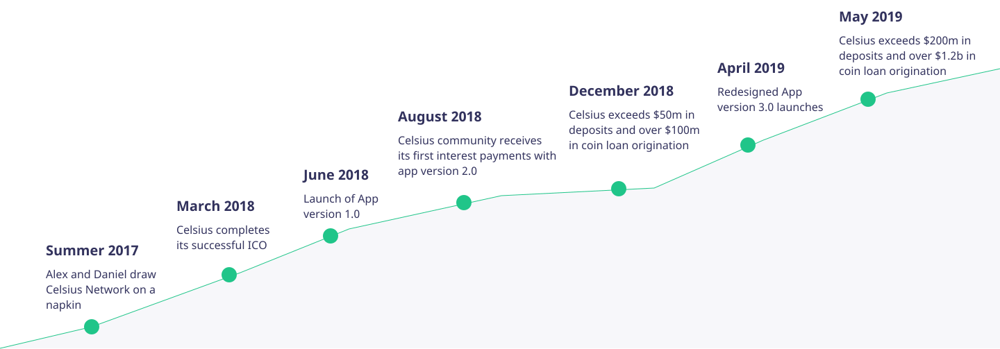
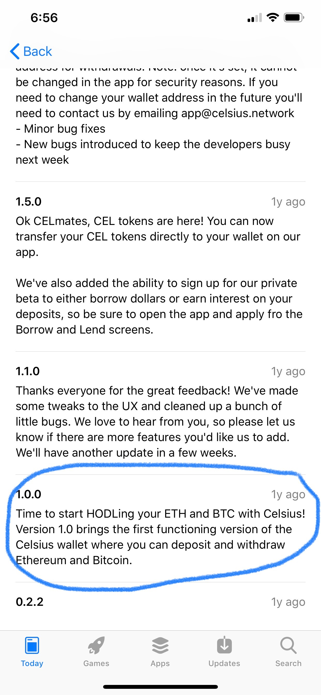

# Celsius Network

*The world needs banking but it does not need banks.*

*#UnbankYourself*

## Overview and Origin
----
The Celsius idea was born on a piece of napkin in the summer of 2017. Wanting to fix the broken traditional banking system, Alex Mashinsky and S. Daniel Leon came up with a model that could disrupt traditional banking by providing financial services that act in the interest of the people. The company's mission is to "harness blockchain technology to provide unprecedented financial freedom, economic opportunity, and income equality for the 99%."

###### *Image Source: [Company Website](https://celsius.network)*

On March 23rd, 2018, the company successfully completed its ICO (Initial Coin Offering) raising USD 50mm with CEL tokens sold at USD 0.20 each.

In June 2018, the Celsius app version 1.0.0 was launched enabling the crypto community to create a wallet for their ETH and BTC coins. The wallet earns interest on coin deposits and allows users to borrow cash using the coins as collateral.

Since its launch, the company has continously broken records. As of the latest press release, Celsius now manages more than USD 300mm in deposits and has issued more than USD 2bn of loans.

| AUM | Loan origination | Loan trades completed | Interest payments | Members | Countries |
| :---: | :---: | :---: | :---: | :---: | :---:|
| USD 300mm | USD 2bn | 160,000 | USD 3mm | 40,000 | 160 |

With an impressive 2,165% growth in AUM since its inception and currently operating in Celsius app version 3.1.0, Celsius now allows 19 coins with 7 more underway.

## Business Activities
----

The company believes the traditional banking system is broken arguing that intermediaries have an unfair power over the people. Just by mere introducing the borrowers to the lenders, the current system earns a huge margin by giving back as little as 1% on deposits and charging as high as 25% interest on loans. With a hashtag #unbankyourself and a team led by a serial social entrepreneur who introduced the world to VoIP, Celsius aims to address this problem by providing a platform to earn and borrow on the blockchain. Leveraging on the technology and their asset-crypto-collateral management model, they are able to charge lower interest on loans and higher interest on deposits.

Loans are issued against the users' crypto deposits used as collateral instead of using the traditional credit score, a key obstacle for the underbanked and credit pooor to access financial services. Deposits are in the custody of partner, BitGo. To protect form borrower default, the member's digital assets are backed by the Lenders' Insurance Pool (LIP) which is funded through ICO and Celsius Network fees.

The company is funded by the cryptocurrency token, CEL, which the company also uses to incentivize ownership. By owning CEL, members have access to better interest rates on both their deposits and loans. In addition, Celsius offers CelPay, a service that allows users to send and receive crypto without charging any fees.

By providing an innovative and easily accessible personal finance platform, the company is enabling the shift from using crypto as money-earning asset to using it as a form of exchange. Celsius believes that an increased adoption of the cryptopcurrency shifts the power from the traditional banks back to the people, democratizing interest income and sharing as much as 80% of revenue to their customers.

To expand coverage and userbase, the company allows integration of corporate partners with the Celsius network. Using Celsius API, partners are able to use or delegate access to the company's proprietary network, with features that include KYC checking, deposits and withdrawals, and balance checking.

## Landscape
----

One of Forbes' 10 FinTech start-ups to watch in 2018, Celsius covers multiple FinTech domains including personal finance, lending, blockchain, cryptocurrency, open banking and payments. Although arguably, the company's primary business model aims to disrupt the peer-to-peer lending.

Peer-to-peer lending started in February 2005 with the launch of a UK company, Zopa. A year after, the US launched its first P2P lending Prosper, the first US P2P lending start-up, followed by now the market leader, Lending Club.

Despite increased regulatory pressure over the years, the trend predicts that by 2024 the market will have grown to USD 898bn, a 48.2% CAGR from 2016. This promising trend has compelled big players in traditional banking to respond with investments such as Marcus by Goldman Sachs. Although it is not clear whether this market includes the crypto market, it is clear that there is an upside potential for crypto-lending blockchain companies like Celsius to take advantage of.

Looking specifically at the crypto ecosystem, Celsius is competing with start-ups offering similar services like SALT, Ethlend and Nexo. Celsius's clear advantage on the competition is primarily on having trusted third party custody on both crypto, cash margin and collateral - not to mention the cred of its CEO and founder, Alex Mashinsky whose proven track record on utilizing technology to introduce industry-disrupting social democratic revolution attracts loyal customer base.

##### *Image source: https://cryptorated.com/ico-rating/celsius-network/*

****

## Results
----

With an audacious goal of being the killer app to help onboard 100M into the crypto ecosystem, Celsius has become one of the frontrunners in expanding the adoption of crypto. Although no crypto adoption rate attributable to Celsius services have been reported, it is evident how they are paving the way for fiat-using no-knowledge-of-blockchain individuals to get into the system.

The unprecedented growth of Celsius' AUM, besting SALT, a year older than Celsius, by USD 269mm has everyone in the crypto community interested in how the company will perform going forward. Inching closer to the 200K customer base of Nexo, a fintech lending company operating for more than 10 years, Celsius has ammassed 40K members in just 2 years of operations.

| Metrics | Celsius | SALT | ETHLend | Nexo |
| :--- | :---: | :---: | :---:| :---: |
| AUM in USD | 300mm | 31mm | 848K | *no info avail* |
| Loan orig. in USD | USD 2bn | *no info avail* | 466K | *no info avail*|
| Members | 40K | *no info avail* | *no info avail* | 200K |
| Jurisdictions | 160+ countries | *no info avail* | *no info avail* | 250+ countries | 

An infant in the domain of lending, Celsius has already achieved milestones that no other fiat P2P lending companies or traditional banks has.

## Emerging Concern and Recommendation
----

Celsius has been very transparent on how they protect their customer's digital assets. From a custodial perspective, they have a strong partnership with BitGo, which employs a minting process of assets received providing protection from theft or security compromise. From a credit risk perspective, as aformentioned, deposits are backed by the LIP.

Despite a seemingly rigid security model, there is an emerging concern on how the company is managing its operational and regulatory risk, in particular on its lending practices. It has been reported that Celsius lends on the margin-trading exchange Bitfinex, which is currently involved in controversial legal battles and regulatory investigations. While margin trading platforms absorbs the risk of default on loans, default of the exchange itself introduces a critical risk to Celsius that cannot be ignored.

One potential solution is providing fiduciary insurance on their user's deposits, similar to how traditional banks are insured by FDIC. Such a service, which one of their competitors, Salt, has started offering this year, can provide the peace of mind and tame the speculation on the continued success of the company.

Unlike Salt, which covers crime and cyber liability Celsius can benefit from introducing insurance covering third party default. Arguably a challenging task given the relatively small market on crypto insurance, there have been use cases for blockchain to potentially disrupt the industry.

## Addendum - References
----

https://celsius.network

https://www.coingecko.com/

https://bitcoinexchangeguide.com/celsius-network-sees-a-20x-increase-in-deposits-however-many-analysts-are-concerned/

https://www.businesswire.com/news/home/20190801005758/en/%C2%A0Celsius-Tops-300-Million-Coin-Deposits-Completes

https://www.badcredit.org/news/celsius-network-offers-crypto-based-financial-services/

https://www.forbes.com/sites/rachelwolfson/2019/02/05/leading-cryptocurrency-platform-completes-over-630m-in-crypto-loans-in-six-months/#e51472a526d9

https://www.forbes.com/sites/andrewrossow/2018/07/10/top-10-new-blockchain-companies-to-watch-for-in-2018/#522af8eb5600

https://www.globenewswire.com/news-release/2019/06/18/1870103/0/en/Peer-to-Peer-Lending-Market-to-rise-at-48-2-CAGR-Simplification-of-Modes-Used-for-P2P-Lending-Spurs-Demand-TMR.html

https://www.moneyunder30.com/peer-to-peer-lending-sites-for-borrowers-and-investors

https://www.finder.com/p2p-lending-usa

https://www.theblockcrypto.com/2019/08/26/crypto-lending-firm-celsius-saw-over-2000-growth-in-deposits-but-concerns-surround-the-concentration-risk-of-where-deposits-go/

https://cryptorated.com/ico-rating/celsius-network/

https://trybe.one/celsius-network-how-secure-are-your-assets/

https://trybe.one/celsius-network-a-new-way-to-deposit-borrow-and-earn-interest-with-crypto/

https://insuranceblog.accenture.com/ultimate-guide-to-blockchain-in-insurance

https://cryptofundresearch.com/salt-blockchain-asset-partners-fund-info/

https://saltlending.com/

https://blog.saltlending.com/are-your-crypto-assets-100-covered-salt-announces-new-more-expansive-insurance-coverage-32b82ef0bba3

https://ethlend.io/stats

https://nexo.io