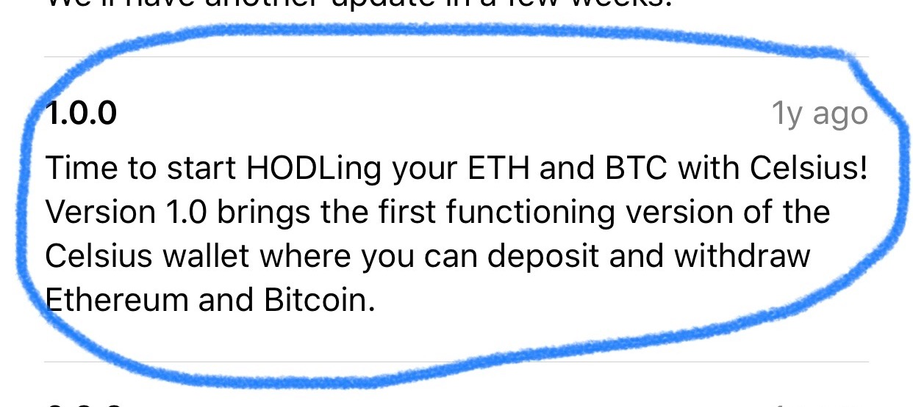

# Celsius Network

*The world needs banking but it does not need banks.*

*#UnbankYourself*

## Overview and Origin

Celsius Network was born on a piece of napkin on the premise that banking is broken. In the summer of 2017, Alex Mashinsky and S. Daniel Leon came up with a model that could disrupt traditional banking by providing financial services that act in the interest of the people. The company's mission is to "harness blockchain technology to provide unprecedented financial freedom, economic opportunity, and income equality for the 99%."

On March 23rd, 2018, the company successfully completed its ICO (initial coin offering) raising USD 50mm with CEL tokens sold at USD 0.20 each.

<coingecko-coin-ticker-widget currency="usd" coin-id="celsius-degree-token" locale="en"></coingecko-coin-ticker-widget>

In June 2018, the Celsius app version 1.0.0 was launched initially allowing users to create a wallet for depositing and borrowing their ETH and BTC coins. Currently operating in version 3.1.0, the app allows 19 coins with 7 more underway.

## Business Activities:

* What specific financial problem is the company or project trying to solve?

- **Low interest on deposits, high interest on loans**

* Who is the company's intended customer?  Is there any information about the market size of this set of customers? 

- **Anyone who has digital assets aka cryptocurrencies, **

What solution does this company offer that their competitors do not or cannot offer? (What is the unfair advantage they utilize?) Amazon has 

* Which technologies are they currently using, and how are they implementing them? (This may take a little bit of sleuthing–– you may want to search the company’s engineering blog or use sites like Stackshare to find this information.)

## Landscape:

* What domain of the financial industry is the company in? Payments

* What have been the major trends and innovations of this domain over the last 5-10 years? Mobile P2P payments, NFC

* What are the other major companies in this domain? Apple Pay, PayPal, Google Pay, Samsung Pay

## Results

* What has been the business impact of this company so far?

* What are some of the core metrics that companies in this domain use to measure success? How is your company performing, based on these metrics?

* How is your company performing relative to competitors in the same domain?

## Recommendations

* If you were to advise the company, what products or services would you suggest they offer? (This could be something that a competitor offers, or use your imagination!) 

* Why do you think that offering this product or service would benefit the company?

* What technologies would this additional product or service utilize? 

* Why are these technologies appropriate for your solution?

## Addendum - References
 https://www.coingecko.com/